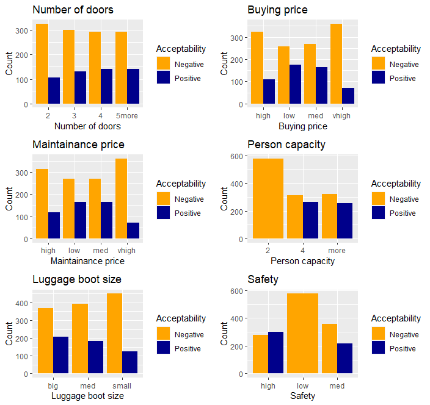
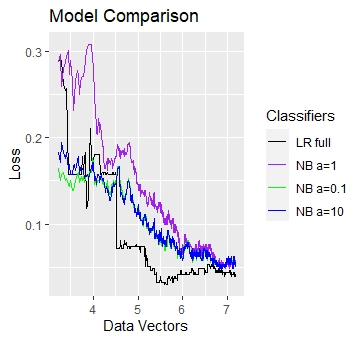

## Table of contents
* [General info](#general-info)
* [Data](#data)
* [Results](#results)

## General info
### Goal:
The goal of this project is to make a comparison between the Naive Bayes and Logistic Regression classifiers in a binary classification problem, where the goal is to predict if a car's evaluation is either "Positive" or "Negative". Additionally, we deal with class imbalance using a technique called Synthetic Minority Oversampling (SMOTE). 

### Libraries:
This project is created using **R version: 4.0.1**. The following libraries are used:

- e1071
- ggplot2
- gridExtra
- ROCR
- DMwR
- MASS

### Scripts:
* **Comparative_Study.R** contains a model comparison between three Naive Bayes models with different Laplace parameters and a full Logistic Regression model. 
* **Classification.R** addresses the problem of unbalanced classes and compares the performance of the models when using a balanced versus an unbalanced training set.

## Data
the file car.data.txt contains the car evaluation dataset which can be found in [UCI Machine Leaning repository](https://archive.ics.uci.edu/ml/datasets/car+evaluation). The data consists of 1728 complete observations and the 7 following variables:

- buying : buying price 
- maint : price of maintainance
- doors : number of doors
- persons : capacity in terms of persons to carry
- lug_boot : the size of luggage boot
- safety : estimated safety of the car
- eval : Two categories , "Positive" and "Negative"

## Results

### Comparative study

Naive Bayes and Logistic Regression fall into two different categories of algorithms, these are Generative and Discriminative. Naive Bayes is a Generative algorithm, that means the joint probability P(x,y)=P(y)P(x|y) 
is estimated from the training set before using Baye's rule to estimate Pr(y|x) for the test set. On the other hand, logistic regression is a Discriminative algorithm and the difference from the previous category is that it estimates Pr(y|x) directly from the training data by minimizing an error function. 

There are some advantages and disadvantages in both categories, therefore the best method should be chosen based on the available data. Some advantages of the Naive Bayes as a Generative classifier are that the assumption of independence of features makes computations very simple and fast and it can reach the assymptotic error faster. The latter is an important advantage over Logistic Regression when the training sample size is small because LR tends to overfit for small sample size, therefore Naive Bayes needs less training data to converge. A disadvantage of Naive Bayes is that it cannot learn interactions between features, whereas Logistic Regression can handle correlations between features and can be regularized by using Ridge or LASSO regularization. The main advantage of Logistic Regression over Naive Bayes is that even though it can overfit for small sample sizes, it usually outperformes Naive Bayes when the training size is large because it reaches its assymptotic error slower ("On Discriminative vs. Generative classifiers: A comparison of logistic regression and naive Bayes", Andrew Y. Ng and Michael I. Jordan , University of California, Berkeley, https://papers.nips.cc/paper/2020-on-discriminative-vs-generative-classifiers-a-comparison-of-logistic-regression-and-naive-bayes.pdf). 

### Class Imbalance
The two models were fitted on the original unbalanced training set and a balanced training set which was generated using Synthetic Minority Oversampling (SMOTE). Then, they were evaluated at a similarly unbalanced test set. In both cases of the unbalanced training and test sets, "Negative" is the majoity and "Positive" is the minority class.

SMOTE is an oversampling technique that generates new training data of the minority class by looking at the K-nearest-neighbors of each case.

<table>
    <caption>Table 1: Unbalanced training set</caption>
    <thead>
      <tr>
        <th>Model</th>
        <th>Metric</th>
        <th>Negative</th>
        <th>Positive</th>
      </tr>
    </thead>
    <tbody>
        <tr>
            <td>Naive Bayes</td>
            <td>Precision</td>
            <td><code>0.950</code></td>
            <td><code>0.929</code></td>
        </tr>
        <tr>
            <td></td>
            <td>Recall</td>
            <td><code>0.969</code></td>
            <td><code>0.887</code></td>
        <tr>
            <td></td>
            <td>F1 score</td>
            <td><code>0.960</code></td>
            <td><code>0.907</code></td>
        <tr>
            <td></td>
            <td></td>
            <td><code></code></td>
            <td><code></code></td>
        </tr>
        <tr>
            <td>Logistic Regression</td>
            <td>Presicion</td>
            <td><code>0.979</code></td>
            <td><code>0.913</code></td>
        <tr>
            <td></td>
            <td>Recall</td>
            <td><code>0.959</code></td>
            <td><code>0.954</code></td>
        <tr>
            <td></td>
            <td>F1 score</td>
            <td><code>0.969</code></td>
            <td><code>0.933</code></td>
        </tr>
    </tbody>
  </table>

Table 1 shows the performance of the models when they were fitted on the unbalanced training set. The issue here is that these results are highly biased, since the class distribution in the test set has the same kind of imbalance that is present in the training set. This obviously results in very good performance on the test set, but its also a misleading result since the model is unable to generalize. 

<table>
    <caption>Table 2: Balanced training set</caption>
    <thead>
      <tr>
        <th>Model</th>
        <th>Metric</th>
        <th>Negative</th>
        <th>Positive</th>
      </tr>
    </thead>
    <tbody>
        <tr>
            <td>Naive Bayes</td>
            <td>Precision</td>
            <td><code>1.000</code></td>
            <td><code>0.773</code></td>
        </tr>
        <tr>
            <td></td>
            <td>Recall</td>
            <td><code>0.869</code></td>
            <td><code>1.000</code></td>
        <tr>
            <td></td>
            <td>F1 score</td>
            <td><code>0.930</code></td>
            <td><code>0.872</code></td>
        <tr>
            <td></td>
            <td></td>
            <td><code></code></td>
            <td><code></code></td>
        </tr>
        <tr>
            <td>Logistic Regression</td>
            <td>Presicion</td>
            <td><code>1.000</code></td>
            <td><code>0.826</code></td>
        <tr>
            <td></td>
            <td>Recall</td>
            <td><code>0.906</code></td>
            <td><code>1.000</code></td>
        <tr>
            <td></td>
            <td>F1 score</td>
            <td><code>0.950</code></td>
            <td><code>0.904</code></td>
        </tr>
    </tbody>
  </table>

Table 2 provides the performance results when the models are fitted on the balanced training set and evaluated on the unbalanced test set. 